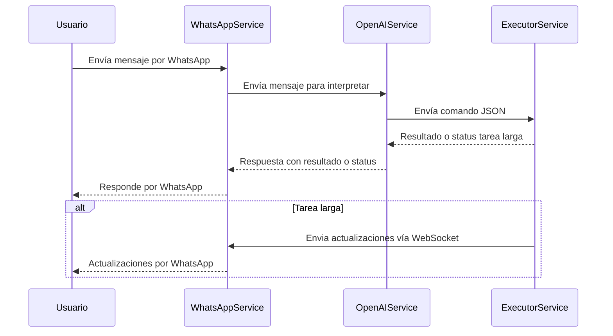

# Chatbot WhatsApp + OpenAI + ERPNext

Este proyecto consiste en un chatbot que utiliza WhatsApp como canal de comunicación, OpenAI para interpretar las solicitudes del usuario y ejecutar scripts o consultas sobre instancias ERPNext. Está diseñado para automatizar tareas administrativas y reportes mediante interacción natural por WhatsApp.

---

## Arquitectura general

El sistema está compuesto por **tres servicios principales**, cada uno en una carpeta diferente:

### 1. `whatsapp_service`

- Aplicación Flask que usa la API oficial de Meta para WhatsApp.
- Recibe mensajes de WhatsApp de los usuarios.
- Envía los mensajes al servicio OpenAI para interpretar y convertirlos en comandos JSON.
- Dependiendo de la tarea, recibe respuesta directa o se conecta vía WebSocket para recibir actualizaciones en tiempo real de tareas largas.
- Envía las respuestas finales al usuario por WhatsApp.

### 2. `openai_service`

- Servicio que recibe el mensaje de WhatsApp del `whatsapp_service`.
- Utiliza OpenAI para interpretar el mensaje y generar un JSON con el endpoint y parámetros correctos.
- Decide si la tarea es corta o larga:
  - Tareas cortas: responde directamente con el resultado.
  - Tareas largas: responde con código HTTP 202 y el `whatsapp_service` se conecta vía WebSocket para seguimiento.

### 3. `chatbot_executor_service`

- Aplicación Flask que recibe los JSON de comandos desde `openai_service`.
- Ejecuta las tareas y consultas en ERPNext mediante su API o directamente con conexión a la base de datos (usando túnel SSH).
- Implementa un servidor Socket.IO para emitir eventos de estado de tareas largas.
- Envía resultados o actualizaciones a los clientes WebSocket.

---

## Flujo de mensajes



---


## 🔗 Conexión con la API de WhatsApp de Meta for Developers

Para conectar este sistema con la API de WhatsApp de Meta for Developers, sigue los siguientes pasos:

### 1. Crear la app en Facebook Developers

1. Ve a [https://developers.facebook.com/](https://developers.facebook.com/).
2. Inicia sesión con tu cuenta de Facebook y crea una nueva aplicación.
3. Selecciona el tipo de app que mejor se adapte a tu caso (por ejemplo, "Negocio").

### 2. Configurar WhatsApp API Setup

1. Una vez creada la app, selecciona **WhatsApp** como producto y haz clic en **Set up**.
2. Accede a la sección **WhatsApp API Setup**.
3. Crea un token de acceso temporal.
4. Agrega los **números de teléfono destinatarios** con los que deseas realizar pruebas.

> **Nota:** Estos números deberán verificar el mensaje inicial por WhatsApp.

### 3. Token de acceso permanente (opcional pero recomendado)

Para generar un token de acceso permanente:

1. Accede al **Administrador comercial (Business Manager)** desde [https://business.facebook.com/](https://business.facebook.com/).
2. Ve a la configuración del negocio:
   - Agrega tu app como **activo**.
   - Crea un nuevo usuario administrador si aún no tienes uno.
3. Dirígete a **Herramientas > Tokens del sistema**.
4. Crea un token para tu app y selecciona los siguientes permisos:
   - `whatsapp_business_management`
   - `whatsapp_business_messaging`
5. Guarda el token y úsalo en tu archivo `.env` como `META_WA_TOKEN`.

### 4. Configurar Webhook

1. En tu app de Facebook Developers, accede a **Webhooks** en el menú lateral.
2. Agrega un nuevo webhook para el producto **WhatsApp**.
3. Usa la siguiente URL (ajústala según tu entorno):  
   `https://TU_DOMINIO/whatsapp`

   > 💡 Si estás trabajando localmente, puedes exponer tu servicio usando [ngrok](https://ngrok.com/):  
   > ```bash
   > ngrok http 8501
   > ```
   > Esto te dará una URL pública temporal que puedes usar como webhook.

4. Durante la configuración, te pedirá un **token de verificación**. Usa el valor de `WHATSAPP_ACCESS_TOKEN` definido en tu archivo `.env` del servicio `whatsapp_service`.
5. Una vez verificada la URL, **suscribe el evento `messages`** para recibir los mensajes entrantes desde WhatsApp.

---

## Despliegue en modo desarrollo local con Docker

Para ejecutar la aplicación en modo desarrollo local utilizando Docker, sigue estos pasos:

1. Crear los .env para los 3 servicios, agregar el json con `datos_empresa.json` y `google_service_account.json` en chatbot_executor_service/config/credentials.

2. Generar una URL pública para el servicio `whatsapp_service` usando ngrok con el comando: `ngrok http 8501`. Esto generará una URL pública que podrás usar para configurar el webhook.

3. Validar el webhook en Meta usando la URL pública generada por ngrok. Este proceso está explicado en la sección anterior de este README.

4. Dar permisos de escritura y ejecución al archivo `chatbot_executor_service/entrypoint_dev.sh`. Este archivo ejecuta un script Python que abre el túnel SSH y también levanta la app Flask del propio servicio ejecutor.

```bash
chmod +x chatbot_executor_service/entrypoint_dev.sh
```

5. Ejecutar `docker compose -f docker-compose.dev.yml up -d` para levantar los servicios definidos en el archivo de configuración.

---

**Nota importante:**  
Con esta configuración, al usar volúmenes en Docker Compose, los cambios que realices en el sistema de archivos local se reflejarán directamente dentro de los contenedores, facilitando el desarrollo y pruebas en tiempo real.
